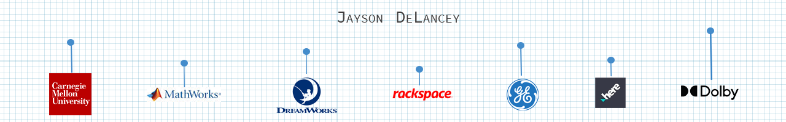

  

  
  &nbsp; &nbsp; &nbsp;
  
  &nbsp; &nbsp; &nbsp;
  
  &nbsp; &nbsp; &nbsp;
  

# Gallery

<table width="75%">
<tr>

<td width="25%" valign="top" style="padding-top: 20px; padding-bottom: 20px; padding-left: 30px; padding-right: 30px;">

<b><a href="https://github.com/j12y/predix-volcano-app">predix-volcano-app</b></a>

Reference Application for data analysis of Masaya Volcano data using Flask, PredixPy, TimeSeries, Asset, UAA, and PredixUI 
        

</td>

<td width="25%" valign="top" style="padding-top: 20px; padding-bottom: 20px; padding-left: 30px; padding-right: 30px;">

<b><a href="https://github.com/j12y/san-diego-streetlights">san-diego-streetlights</b></a>

Smart City Street Light Visualization of San Diego, CA 
                

</td>

<td width="25%" valign="top" style="padding-top: 20px; padding-bottom: 20px; padding-left: 30px; padding-right: 30px;">

<b><a href="https://github.com/j12y/sentiment-analysis-reddit">sentiment-analysis-reddit</b></a>

Project to do a sentiment analysis of Reddit stories and comments in a technical community 
          

</td>

</tr>
<tr>

</tr>
</table>

Explore more projects:  
         
                                  

# Learn

Read some of my most recent technical blog posts on <a href="https://dev.to/@j12y">Dev.to</a>, <a href="https://medium.com/@j12y">Medium</a>, and <a href="https://dolby.io/blog/author/jdela/">Dolby.io</a>.

<table width="75%">
<tr>
<td width="25%" valign="top" style="padding-top: 20px; padding-bottom: 20px; padding-left: 30px; padding-right: 30px;">
  

  
  
<b><a href="https://dev.to/j12y/query-github-repo-topics-using-graphql-35ha">Query GitHub Repo Topics Using GraphQL</a></b>

  
Creating a customized user profile page for GitHub to showcase work projects and make navigation to relevant topics easier. This is part 2 of 4....

</td>
<td width="25%" valign="top" style="padding-top: 20px; padding-bottom: 20px; padding-left: 30px; padding-right: 30px;">
  

  
  
<b><a href="https://j12y.medium.com/a-location-based-todo-app-a6cf3ecc096a?source=rss-f3c028e6e549------2">A Location Based TODO App</a></b>

  
I wanted to use React to build a TODO application that takes into account where I need to be to complete a task. I don’t “buy milk” while…...

</td>
<td width="25%" valign="top" style="padding-top: 20px; padding-bottom: 20px; padding-left: 30px; padding-right: 30px;">
  

  
  
<b><a href="https://dolby.io/blog/build-a-video-call-app-for-music-lessons-or-live-performances/">How-to Build a Video Call App for Music Lessons or Live Performances</a></b>

  
Music capture mode allows you to enhance the sound of music in your voice and video calls by customizing noise suppression, boosting volume, providing...

</td>
</tr>
</table>

# Community

Thanks for your interest in my projects. If you have a question or feedback about any of my projects, use <a href="https://github.com/j12y/j12y/discussions">GitHub Discussions</a> and let me know what you think.
    
Follow me or star this repos to add yourself to the community and receive future updates. 

  

  
Community (81)

  
&nbsp;

  

<a href="https://github.com/samirm">samirm</a> <a href="https://github.com/hno3kyoz">hno3kyoz</a> <a href="https://github.com/SVyatkin">SVyatkin</a> <a href="https://github.com/roscopecoltran">roscopecoltran</a> <a href="https://github.com/privatejava">privatejava</a> <a href="https://github.com/zapjelly">zapjelly</a> <a href="https://github.com/aaronbesson">aaronbesson</a> <a href="https://github.com/azizur">azizur</a> <a href="https://github.com/dgeorgiev">dgeorgiev</a> <a href="https://github.com/miccoh1994">miccoh1994</a> <a href="https://github.com/Orhianna">Orhianna</a> <a href="https://github.com/ggallon">ggallon</a> <a href="https://github.com/SebastianKurp">SebastianKurp</a> <a href="https://github.com/irfanquresh">irfanquresh</a> <a href="https://github.com/Ciscoox">Ciscoox</a> <a href="https://github.com/maddraddness">maddraddness</a> <a href="https://github.com/neilrjones">neilrjones</a> <a href="https://github.com/Doanvuonglinh">Doanvuonglinh</a> <a href="https://github.com/albertico-gov">albertico-gov</a> <a href="https://github.com/TvoiKotikB">TvoiKotikB</a> <a href="https://github.com/Briggs599">Briggs599</a> <a href="https://github.com/j12y">j12y</a> <a href="https://github.com/cardoso">cardoso</a> <a href="https://github.com/piscespieces">piscespieces</a> <a href="https://github.com/neptunel">neptunel</a> <a href="https://github.com/TheNetworkGirl">TheNetworkGirl</a> <a href="https://github.com/ugke">ugke</a> <a href="https://github.com/7dp">7dp</a> <a href="https://github.com/macribas">macribas</a> <a href="https://github.com/bcehmu">bcehmu</a> <a href="https://github.com/ArnaudBienner">ArnaudBienner</a> <a href="https://github.com/PranamBhat">PranamBhat</a> <a href="https://github.com/drewp">drewp</a> <a href="https://github.com/vinzlercodes">vinzlercodes</a> <a href="https://github.com/pranavkaul">pranavkaul</a> <a href="https://github.com/Jayshah6699">Jayshah6699</a> <a href="https://github.com/SealAWrap">SealAWrap</a> <a href="https://github.com/faroit">faroit</a> <a href="https://github.com/csteinmetz1">csteinmetz1</a> <a href="https://github.com/hkrhasan">hkrhasan</a> <a href="https://github.com/dmitropohrebniak">dmitropohrebniak</a> <a href="https://github.com/wdeluca5">wdeluca5</a> <a href="https://github.com/mgappleton">mgappleton</a> <a href="https://github.com/surendra4586059">surendra4586059</a> <a href="https://github.com/dlb-jfan">dlb-jfan</a> <a href="https://github.com/lnx1337">lnx1337</a> <a href="https://github.com/waltmanjk004">waltmanjk004</a> <a href="https://github.com/mhuot">mhuot</a> <a href="https://github.com/ebk13579">ebk13579</a> <a href="https://github.com/steffmul">steffmul</a> <a href="https://github.com/iyyappan16">iyyappan16</a> <a href="https://github.com/dbabbs">dbabbs</a> <a href="https://github.com/Stahlwalker">Stahlwalker</a> <a href="https://github.com/jessieqiqi">jessieqiqi</a> <a href="https://github.com/Masakikat">Masakikat</a> <a href="https://github.com/8Mobius8">8Mobius8</a> <a href="https://github.com/xiaoyan-huang-bhc3">xiaoyan-huang-bhc3</a> <a href="https://github.com/carolyn-ma">carolyn-ma</a> <a href="https://github.com/alonzazo">alonzazo</a> <a href="https://github.com/yosit">yosit</a> <a href="https://github.com/ThisWillGoWell">ThisWillGoWell</a> <a href="https://github.com/RawanGharbawi">RawanGharbawi</a> <a href="https://github.com/IgorRedaelli">IgorRedaelli</a> <a href="https://github.com/windplant">windplant</a> <a href="https://github.com/vikhyatK">vikhyatK</a> <a href="https://github.com/ehsanwaris">ehsanwaris</a> <a href="https://github.com/shopped">shopped</a> <a href="https://github.com/vshevchyk">vshevchyk</a> <a href="https://github.com/lokidg">lokidg</a> <a href="https://github.com/BHC3-RobSchafer">BHC3-RobSchafer</a> <a href="https://github.com/chengicoding">chengicoding</a> <a href="https://github.com/AmrHRAbdeen">AmrHRAbdeen</a> <a href="https://github.com/palmcorp">palmcorp</a> <a href="https://github.com/paul1882">paul1882</a> <a href="https://github.com/sourcegate">sourcegate</a> <a href="https://github.com/pervak">pervak</a> <a href="https://github.com/kopasetik">kopasetik</a> <a href="https://github.com/coolioxlr">coolioxlr</a> <a href="https://github.com/angusshire">angusshire</a> <a href="https://github.com/smashwilson">smashwilson</a> <a href="https://github.com/BaiMianBao">BaiMianBao</a> 
  

  

  
  

&nbsp;

# Statistics

  
Statistics

  
&nbsp;

  

    
Repos: 60

    
Followers: 62

    
Stargazers: 81

    
Supporters: 81

    
Unique Views (week): 1

  

*Last Updated: Sat Apr 08 2023*